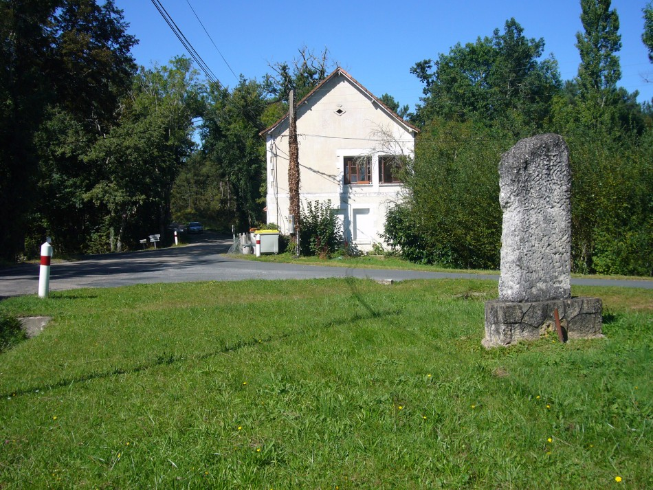
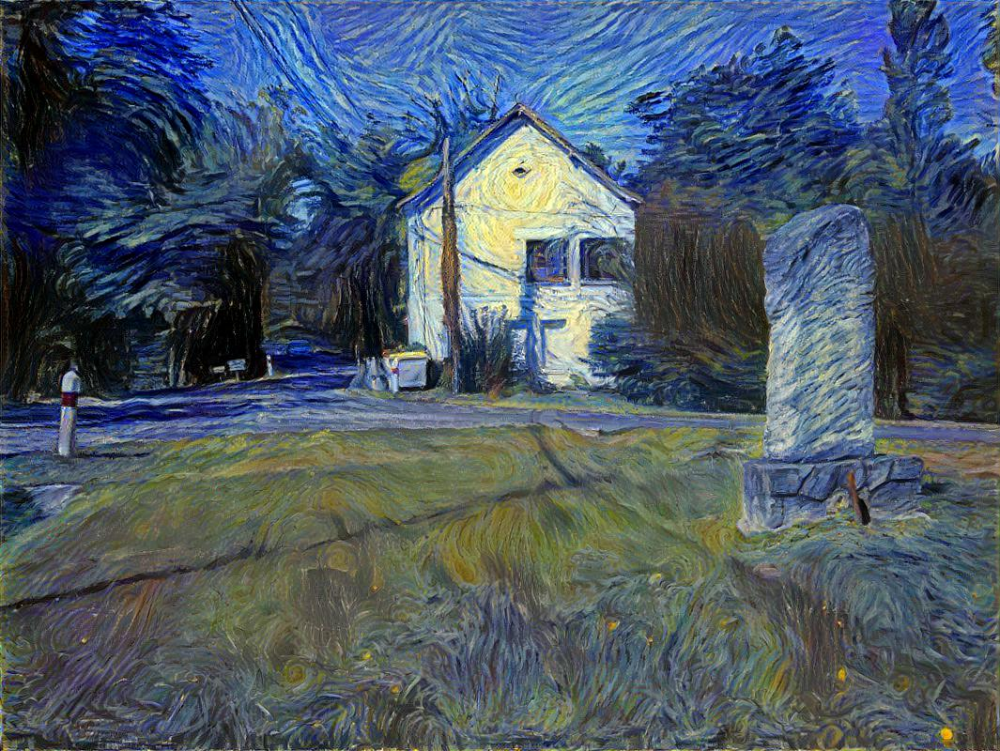

# Style Transfer with Pytorch

Style Transfer playground using Pytorch. Basic implementation of the paper [Image Style Transfer Using Convolutional Neural Networks](http://www.cv-foundation.org/openaccess/content_cvpr_2016/html/Gatys_Image_Style_Transfer_CVPR_2016_paper.html), inspired by the [authors' code](https://github.com/leongatys/PytorchNeuralStyleTransfer).

## Usage

First, download the weights of the VGG-19 model used by the authors [here](https://bethgelab.org/media/uploads/pytorch_models/vgg_conv.pth). Then, simply run `python main.py`. You can change the parameters in the file `config.py`.

## Example

Content image:

Style image:

output image:
